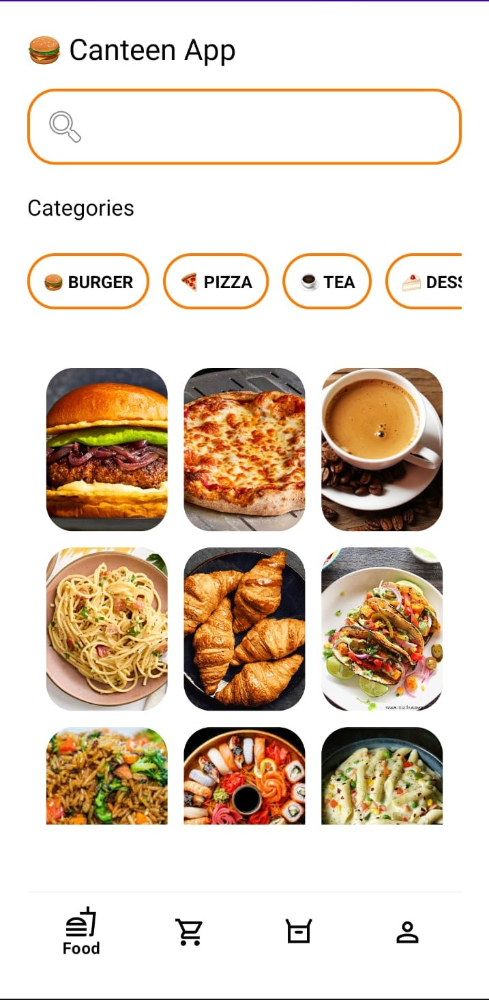
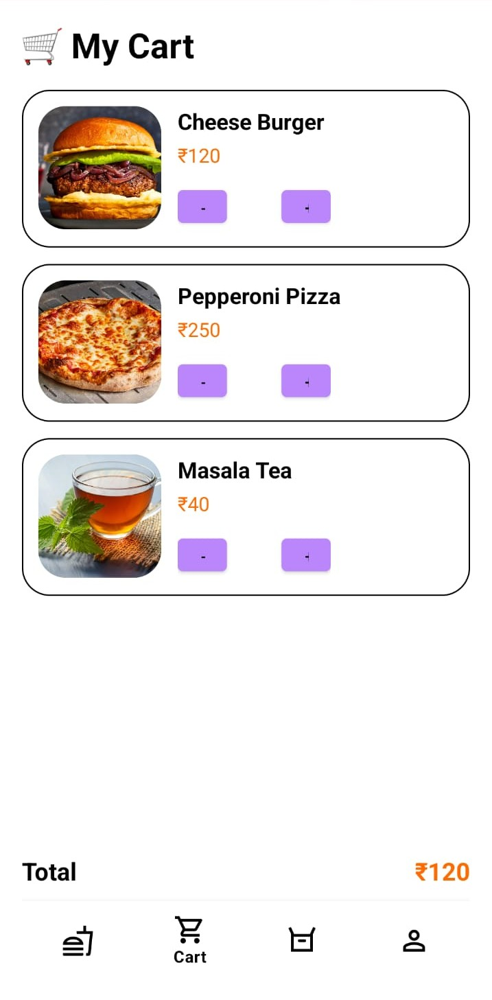
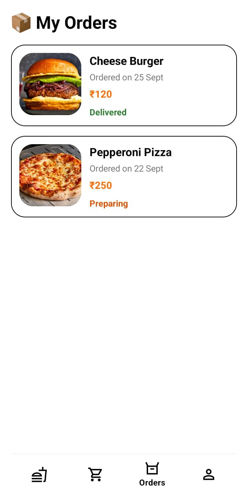
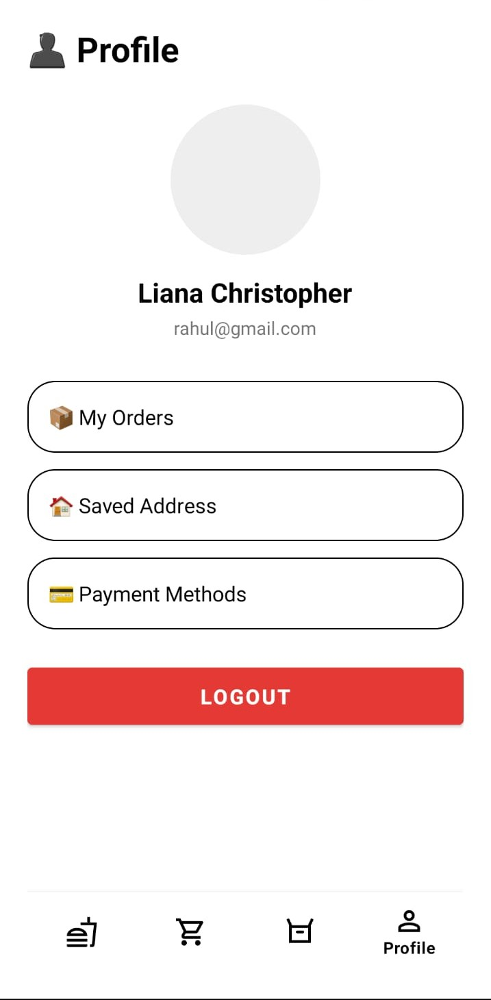

# 🍔 CanteenApp

[](https://developer.android.com)
[](https://www.java.com/)
[](LICENSE)

**CanteenApp** is a modern, user-friendly Android application designed to streamline the food ordering experience in canteens. With a sleek UI and intuitive navigation, users can browse categories, search for their favorite meals, and manage their orders with ease.

---

## 🚀 Features

- **🍔 Diverse Menu**: Browse through various categories like Burgers, Pizza, Tea, Desserts, and more.
- **🔍 Smart Search**: Quickly find the food you're craving using the built-in search bar.
- **🛒 Cart Management**: Seamlessly add items to your cart and review them before ordering.
- **📦 Order History**: Keep track of your previous and current orders.
- **👤 User Profile**: Manage your personal information and preferences.
- **📱 Responsive UI**: Beautifully designed layouts using Material Design components.

---

## 🛠 Tech Stack

- **Language**: Java / Kotlin
- **UI Framework**: XML Layouts with Material Components
- **Architecture**: MVC/MVVM (Standard Android)
- **Navigation**: BottomNavigationView for fluid app navigation
- **Images**: Loaded via high-quality drawables with rounded corners and card styles.

---

## 📸 Screenshots
|                 Home Screen                  |                  Cart                  |                       Orders                       |                    Profile                     |
|:--------------------------------------------:|:--------------------------------------------:|:------------------------------------------------:|:----------------------------------------------:|
|  |  |  |  |

*(Note: Replace these placeholders with actual screenshots of your app running on an emulator or device!)*
---

## 🏁 Getting Started

### Prerequisites

- [Android Studio Iguana](https://developer.android.com/studio) or newer.
- Android SDK Level 34 (Upside Down Cake) or higher.
- Java Development Kit (JDK) 17.

### Installation

1. **Clone the repository**:
   ```bash
   git clone https://github.com/yourusername/CanteenApp.git
   ```
2. **Open the project**:
   Open Android Studio and select `Open` -> Browse to the `CanteenApp` folder.
3. **Sync Gradle**:
   Wait for the project to sync and download dependencies.
4. **Run the app**:
   Connect an Android device or start an emulator and click the `Run` button.

---

## 📂 Project Structure

```text
CanteenApp/
├── app/
│   ├── src/
│   │   ├── main/
│   │   │   ├── java/com/app/canteenapp/  # Source code
│   │   │   │   ├── MainActivity.java     # Home screen logic
│   │   │   │   ├── CartActivity.java     # Cart management
│   │   │   │   ├── OrdersActivity.java   # Order tracking
│   │   │   │   └── ProfileActivity.java  # User profile
│   │   │   └── res/
│   │   │       ├── layout/               # XML Layout files
│   │   │       ├── drawable/             # Image resources and backgrounds
│   │   │       └── menu/                 # Bottom navigation menu
└── build.gradle.kts                      # Project configurations
```

---

## 🤝 Contributing

Contributions are welcome! If you'd like to improve the app, feel free to fork the repo and create a pull request.

1. Fork the Project
2. Create your Feature Branch (`git checkout -b feature/AmazingFeature`)
3. Commit your Changes (`git commit -m 'Add some AmazingFeature'`)
4. Push to the Branch (`git push origin feature/AmazingFeature`)
5. Open a Pull Request

---

## 📄 License

Distributed under the MIT License. See `LICENSE` for more information.

---

<p align="center">Made with ❤️ for hungry students everywhere!</p>
